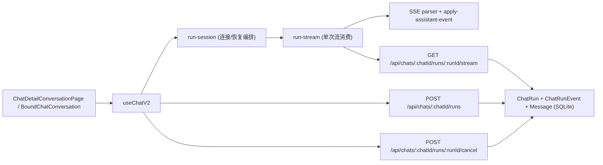

# SSE Chat 示例工程（TanStack Start 全栈）

这是一个基于 TanStack Start + React + Prisma(SQLite) 的会话应用示例，重点实现了：

- 会话树（可分支/可切换游标）
- 服务端流式生成（SSE）
- 刷新后断点续传（`afterSeq + resumeToken`）
- 流式中断、异常、卡死恢复

## 1. 技术栈

- 前端：React 19、TanStack Router、TanStack Query
- 后端：TanStack Start Server Handlers（同仓全栈）
- 存储：Prisma + SQLite
- 流协议：SSE（`eventsource-parser` 在前端解析）

## 2. 目录与分层

- 页面与绑定层：
  - `features/chat/pages/chat-detail-conversation-page.tsx`
  - `features/chat/components/conversation/chat-conversation-bound.tsx`
- Chat Hook（状态机/流式消费）：
  - `features/ai-sdk/hooks/use-chat-v2/useChatV2.ts`
  - `features/ai-sdk/hooks/use-chat-v2/reducer.ts`
  - `features/ai-sdk/hooks/use-chat-v2/run-stream.ts`
  - `features/ai-sdk/hooks/use-chat-v2/run-session/*`
  - `features/ai-sdk/hooks/use-chat-v2/parser.ts`
  - `features/ai-sdk/hooks/use-chat-v2/sse-parser/*`
- API 路由：
  - `src/routes/api/chats/$chatId.ts`
  - `src/routes/api/chats/$chatId/runs/index.ts`
  - `src/routes/api/chats/$chatId/runs/$runId/stream.ts`
  - `src/routes/api/chats/$chatId/runs/$runId/cancel.ts`
- 服务端实现：
  - `src/server/chat/chats-detail.ts`
  - `src/server/chat/chat-runs.ts`
- 存储层：
  - `lib/chat-store/sqlite-store.ts`
  - `lib/chat-store/types.ts`
  - `prisma/schema.prisma`

## 3. 核心架构



前端负责“消费 + 合并 + 恢复”，后端负责“产出 + 持久化 + 回放”。

## 4. 数据模型（续传关键）

`ChatRun`（`prisma/schema.prisma`）

- `resumeToken`：续传令牌
- `status`：`running | done | aborted | error`
- `lastEventSeq`：已写入事件流的最大序号
- `lastPersistedSeq`：已落盘到 assistant message 的安全序号
- `lastHeartbeatAt`：心跳时间

`ChatRunEvent`

- `(runId, seq)` 唯一递增
- `event` + `payloadJson` 存储每个流事件，供 SSE 回放

## 5. API 协议与职责

### 5.1 创建运行

`POST /api/chats/:chatId/runs`

- 创建 assistant 占位消息
- 创建 `ChatRun`
- 初始化 `last_seq=0`、`last_persisted_seq=0`
- 后台异步执行 run（不阻塞请求）

### 5.2 订阅/续传流

`GET /api/chats/:chatId/runs/:runId/stream?afterSeq=...&resumeToken=...`

- 参数校验：`resumeToken` 不匹配返回 `403`
- 回放 `seq > afterSeq` 的事件
- 定期发送 heartbeat（`type: "heartbeat"`）
- 运行结束后发送 `[DONE]`

### 5.3 取消运行

`POST /api/chats/:chatId/runs/:runId/cancel`

- 中止运行控制器
- 更新 run 状态为 `aborted`

### 5.4 会话详情恢复

`GET /api/chats/:chatId`

- 返回 conversation + active_run
- 前端刷新后据此重建 UI 与恢复流连接

## 6. 前端实现（useChatV2）

`useChatV2` 现在是“轻编排层”，职责拆分如下：

- `reducer.ts`：纯状态更新（会话树、输入框、streaming 状态）
- `run-stream.ts`：单次 SSE 连接消费
- `run-session/connect.ts`：重试、退避、失败恢复、收敛
- `run-session/recover.ts`：统一从 `/api/chats/:chatId` 拉快照恢复
- `parser.ts + sse-parser/*`：协议归一化与事件落地

关键点：

- 通过 `runAppliedSeqRef + runtime.sharedAppliedSeqByRun` 维护 seq 门控
- 遇到重复帧（`nextSeq <= appliedSeq`）直接丢弃，避免重复渲染
- 检测序号跳跃（gap）并触发恢复流程
- 刷新后如果存在 `activeRun.status === "running"`，自动续连
- 若发现“有 streaming part 但无 activeRun”，触发快照对账恢复

## 7. SSE 事件处理链

1. `run-stream.ts` 从网络读取 chunk，交给 `parser.feed(...)`
2. `parser.ts` 做协议归一化（支持 `delta` patch 格式和 `v.type` 格式）
3. `apply-assistant-event.ts` 将事件映射到 `MessagePartV2`：
   - `text-*`、`reasoning-*`
   - `tool-input-*`、`tool-output-available`
   - `finish`、`error`、`heartbeat`
4. reducer 把 part 更新到会话树，UI 实时渲染

## 8. 服务端执行与持久化策略

`src/server/chat/chat-runs.ts` 内部：

- 每次 `appendChatRunEvent` 递增 `seq`
- `createRunProgressTracker` 周期性把当前 assistant parts 落盘到 `Message`
- 同步更新 `lastPersistedSeq / lastHeartbeatAt`
- 结束时统一写入：
  - `finish` 事件
  - `message_stream_complete` 事件
  - `completeChatRun(status)`

卡死恢复策略：

- stream 订阅端检测运行“长时间无新事件”后触发 `recoverStalledRunOnce`
- 从历史事件重建 assistant parts，补错误事件并完成 run，避免永远卡住

## 9. 刷新续传的端到端时序

1. 前端提交消息 -> 创建 run
2. 前端订阅 stream（`afterSeq=0`）
3. 中途刷新页面
4. 页面重新请求 `GET /api/chats/:chatId` 拿到 `active_run + conversation`
5. `useChatV2` 用 `lastPersistedSeq`/本地已应用 seq 计算新的 `afterSeq`
6. 重新订阅 `stream`，后端从该序号后继续回放
7. 新事件继续增量渲染，完成后收敛为最终消息

## 10. 开发运行

```bash
pnpm install
pnpm dev
```

默认地址：`http://localhost:3000`

构建验证：

```bash
npm run build
```

## 11. 设计取舍说明

- 使用 `ChatRunEvent` 做事件日志，而不是仅靠内存流，目的是支持刷新续传与审计
- 使用 `lastPersistedSeq` 而不是仅 `lastEventSeq`，目的是提供“已落盘安全点”
- 前端在流完成后仍做一次服务端快照对账，保证最终收敛一致性
